# 母婴产品销售管理系统

### 完整项目获取

通过网盘分享的文件：婴幼儿产品销售系统

链接: https://pan.baidu.com/s/1aRsKtfyDtkIDrGqsUySqhw?pwd=u138 提取码: u138 --来自百度网盘超级会员v3的分享

### 项目合集(项目不断更新中，包含java、vue、python、Android、微信小程序等项目)

链接: https://pan.baidu.com/s/1nY-zhvAK0CXYcn3g7LzQnQ?pwd=id3c 提取码: id3c
--来自百度网盘超级会员v3的分享

### 工具包

链接: https://pan.baidu.com/s/1YmdoJvkjoUjA75wvHLDZ6A?pwd=xm96 提取码: xm96
--来自百度网盘超级会员v3的分享

需要远程项目部署或项目修改和毕业设计也可联系（添加申请时请备注好来意）

### 远程调试部署联系方式

链接: https://pan.baidu.com/s/1W0dDcoZmayG0c7USJDYBYg?pwd=nqd7 提取码: nqd7
--来自百度网盘超级会员v3的分享

#### 这些项目一起发你了 可以分享给你需要的同学 调试可找我 也接二次修改和项目定制、毕业设计等

## 接毕业设计和论文

微信联系方式：xzxj0206  QQ：3808981644   (支持修改、 部署调试、 支持代做毕设)

接网站建设、小程序、H5、APP、各种系统等，单片机、嵌入式也可以做

选题+开题报告+任务书+程序定制+安装调试+论文+答辩ppt  都可以做

# 介绍

基于SSH的婴幼儿产品销售系统

母婴产品销售管理系统/婴幼儿产品销售系统

技术：Java；spring; JSP；Struts2;hibernate

数据库： mysql

web服务器：tomcat

基于SSH的婴幼儿产品销售系统主要实现基本的网络购物的功能。本系统结构如下：

## 1，游客访问

|--系统首页，查看所有的商品信息和相关的菜单信息

|--会员注册，游客可以注册成会员(必须注册之后才能购物)

## 2，会员访问
|--用户登陆，实现用户的登陆操作

|--商品展示

|--会员注册

|--我的购物车

|--我的订单

|--留言反馈

|--促销信息

## 3，管理员访问

|--修改登陆密码  主要功能实现管理员的添加，修改，删除 ，查询

|--商品类型管理  主要实现商品类型的添加，修改，删除，查询功能

|--商品信息管理  主要实现商品信息的添加，修改，删除，查询功能

|--会员信息管理  主要实现会员信息的查询，删除功能

|--订单信息管理  主要实现会员订单的查询和处理功能

|--留言反馈管理  主要实现会员留言的查询和删除功能

|--促销信息管理  主要实现促销信息的查询，添加，删除功能

## 用户端部分页面展示

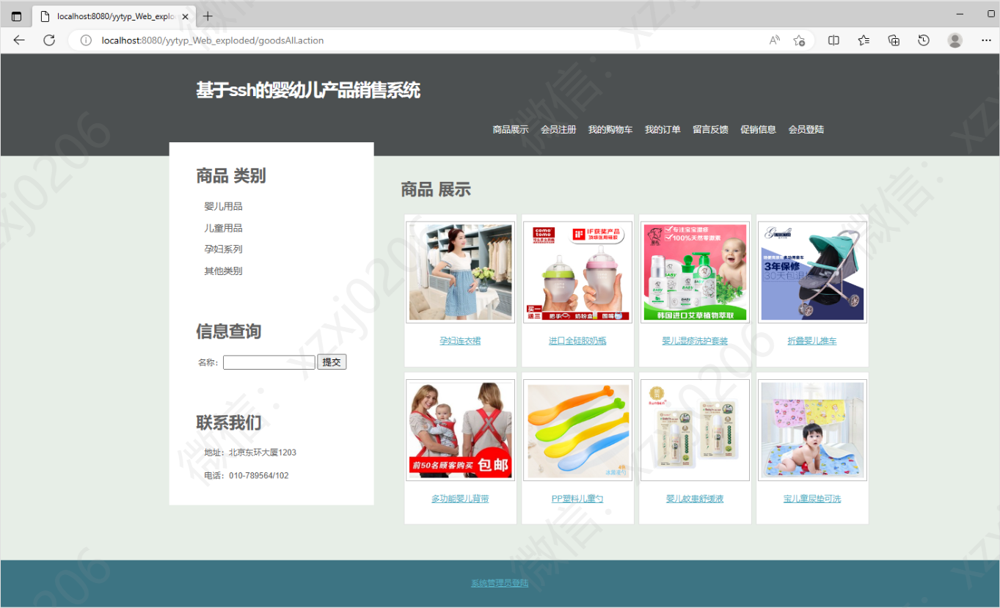

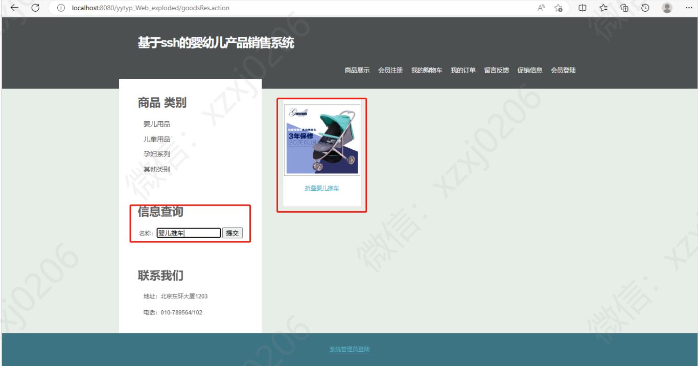

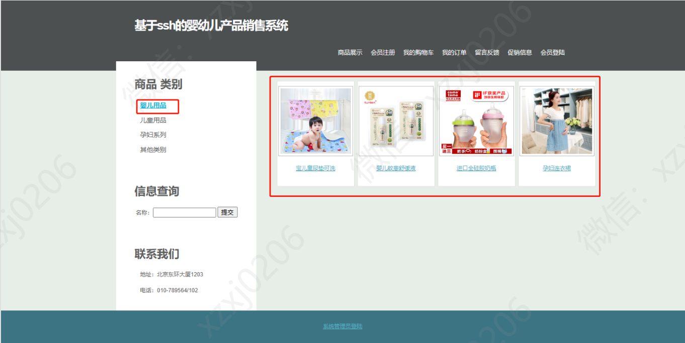

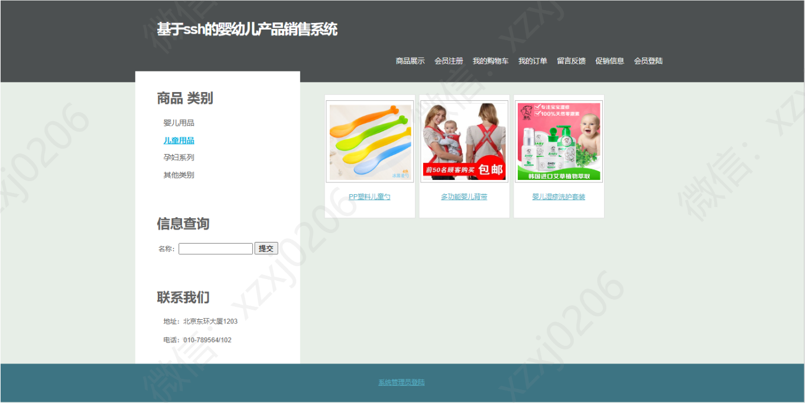

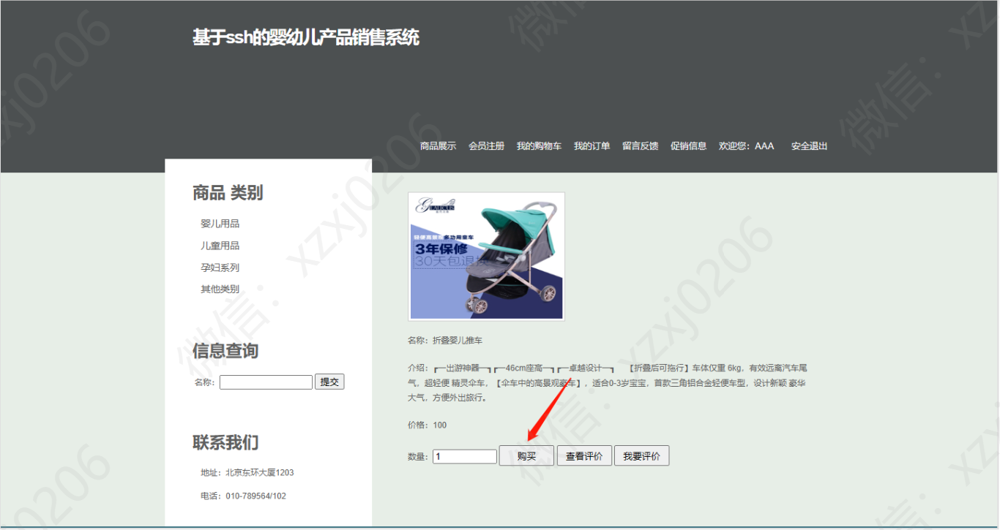

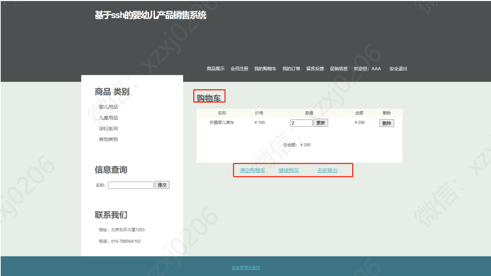

## 管理员部分页面展示

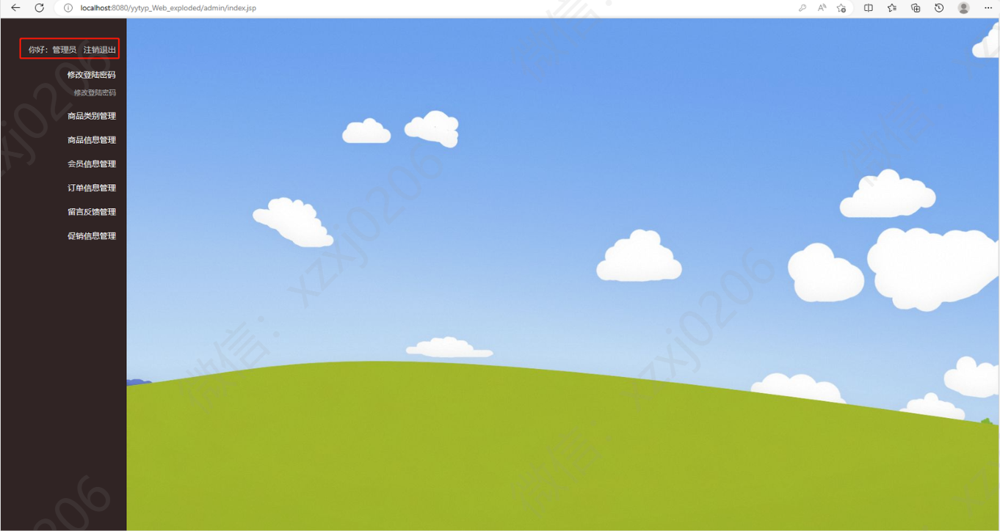

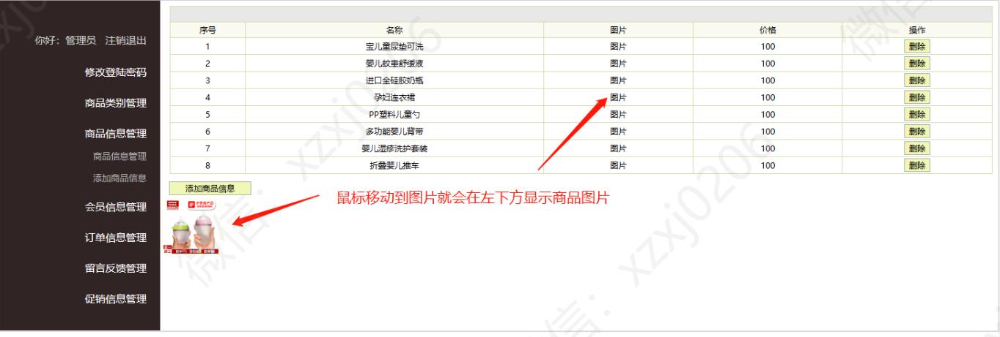

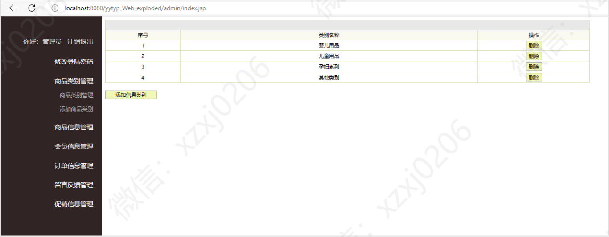

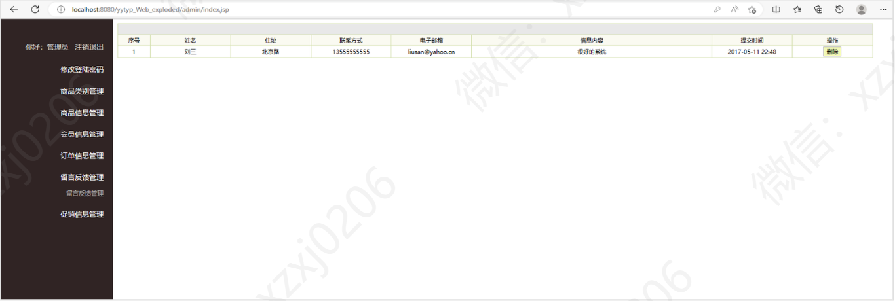

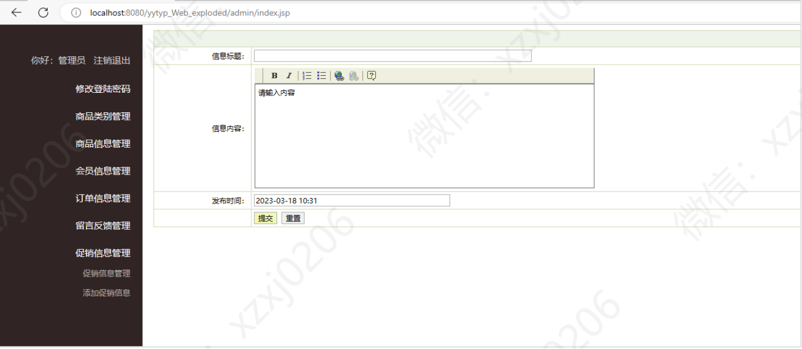

