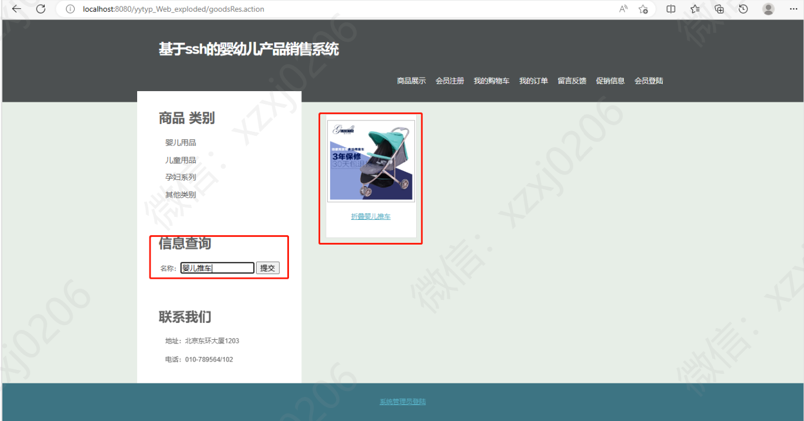
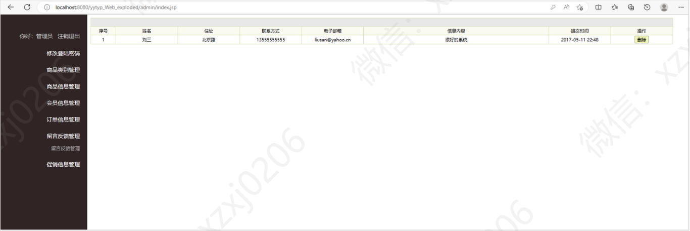

# 母婴产品销售管理系统

有问题， 或者不会调试的同学，可以添加微信（注明项目）：xzxj0206

# 介绍

基于SSH的婴幼儿产品销售系统

六、母婴产品销售管理系统/婴幼儿产品销售系统

技术：Java；spring; JSP；Struts2;hibernate

数据库： mysql

web服务器：tomcat

基于SSH的婴幼儿产品销售系统主要实现基本的网络购物的功能。本系统结构如下：

## 1，游客访问

|--系统首页，查看所有的商品信息和相关的菜单信息

|--会员注册，游客可以注册成会员(必须注册之后才能购物)

## 2，会员访问
|--用户登陆，实现用户的登陆操作

|--商品展示

|--会员注册

|--我的购物车

|--我的订单

|--留言反馈

|--促销信息

## 3，管理员访问

|--修改登陆密码  主要功能实现管理员的添加，修改，删除 ，查询

|--商品类型管理  主要实现商品类型的添加，修改，删除，查询功能

|--商品信息管理  主要实现商品信息的添加，修改，删除，查询功能

|--会员信息管理  主要实现会员信息的查询，删除功能

|--订单信息管理  主要实现会员订单的查询和处理功能

|--留言反馈管理  主要实现会员留言的查询和删除功能

|--促销信息管理  主要实现促销信息的查询，添加，删除功能

## 用户端部分页面展示

## 管理员部分页面展示

